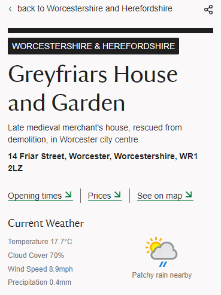

# GoodGrowthTechTest

## Overview

For my solution I decided to use the [weatherapi.com](https://www.weatherapi.com/) API. The free tier does exactly what is needed and is well documented. To get the current weather data I utilised the ‘getting here’ section that is already on the property page. Within this section there is a URL containing the latitude and longitude of the property (used to add a pin on a google map). After extracting the co-ordinates from the URL, I formatted them so they could be passed to the API successfully. Once a response is received, the data is appended to an element on the page.

## Example

## Known Bugs/Issues

When passing the co-ordinates to the API (52.3465, -1.74551 for example), the API shortens them to 2 decimal places (52.35, -1.75). This leads to an inaccuracy of around 0.5 miles in location. This is only a minor discrepancy but the great British weather can be very indecisive!

Without access to the stylesheet and using only inline CSS, I opted to keep the design mobile-first for ease.

## How To

- Register for an API key at [weatherapi.com](https://www.weatherapi.com/)
- Visit any national trust property page eg. (https://www.nationaltrust.org.uk/visit/warwickshire/charlecote-park)
- Copy contents of script.js into chrome console (not forgetting to add in your own API key)
- Hit enter! The weather should now be displayed.
